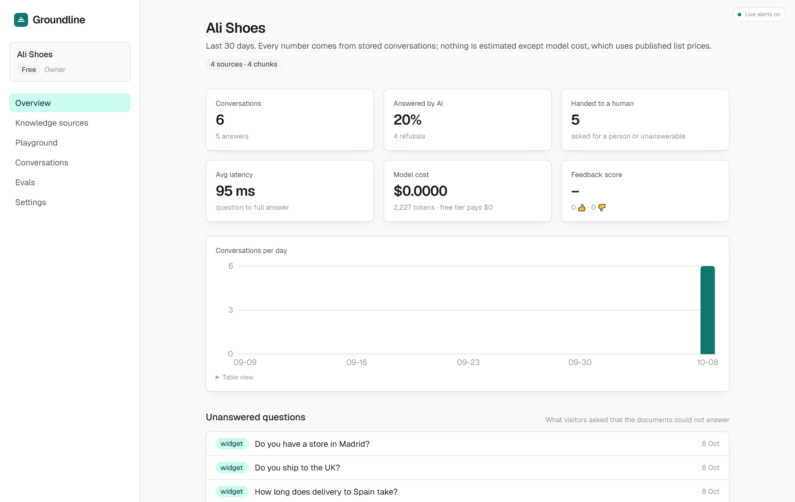

# Groundline

**AI customer support that only says what your docs say.** A multi-tenant platform in the spirit of Intercom Fin / Chatbase: a business adds its website and documents, pastes one script tag, and its visitors get streamed answers grounded in that content with citations. When the assistant cannot answer, a human is paged in real time and takes over the same thread. Accuracy is measured with a per-workspace eval set and can be published.

**Status:** feature-complete for v1, built in 8 weeks on free tiers only · [CI](https://github.com/Mern-Umair/customer-support-groundline/actions)  · Live demo: _deploying_ (see [docs/deploy.md](docs/deploy.md)) · Plan and decisions: [PLAN.md](PLAN.md) · Architecture: [docs/architecture.md](docs/architecture.md)



## What it does

| Area | What ships |
|---|---|
| **Knowledge** | Website crawl (sitemap first, same-site links, robots.txt), PDF and plain-text uploads; Readability extraction with body fallback; recursive chunking (~512 tokens, 64 overlap); Gemini embeddings; Atlas Vector Search with a per-workspace pre-filter; resumable ingestion driven in 25 s steps; re-sync |
| **Answers** | Tenant-scoped retrieval with a score gate, numbered sources, cite-every-claim prompt, exact refusal sentence, citation validation after generation; SSE streaming; tokens, cost (list prices) and latency logged per message |
| **Widget** | One dependency-free script tag → launcher + iframe served from our origin; origin-checked postMessage; public API with per-visitor and per-workspace rate limits and a monthly quota; feedback 👍👎 |
| **Handoff** | Visitor asks for a person, or the assistant refuses → the dashboard rings (Socket.io), a teammate replies in the same thread, visitor sees it live; hand back to AI; HTTP polling fallback when the realtime server sleeps |
| **Agent tools** | Native function calling (Gemini, Groq): `lookupOrder` runs immediately; `createTicket` and `bookAppointment` wait for a teammate's approval; the visitor is told and sees the result in-thread |
| **Insights** | 30-day conversations, answered-by-AI rate, handoffs, latency, cost, feedback score, daily chart, and the list of unanswered questions (what to add to the docs) |
| **Evals** | Per-workspace test set (answerable with reference + expected source, or unanswerable); deterministic refusal and citation checks; LLM judge with a pinned rubric; accuracy, citation hit rate, correct refusals, over-refusal; runs stored for regression; public results page; 40-question demo golden set; CI gate |
| **Teams & plans** | Invite links, owner/agent roles enforced server-side, multi-workspace switching; Free and Pro limits; Stripe Checkout + portal in test mode with a signature-verified, idempotent webhook |
| **Engineering** | TypeScript strict; 113 unit/integration tests (Vitest, real Atlas for retrieval and isolation) and 28 browser tests (Playwright, production build, two-browser handoff and approval flows); GitHub Actions on every push; offline stand-ins for the embedder, the model and the judge so everything runs without API keys |

## Not built (deliberately)

WhatsApp / Slack / email channels · multi-language UI · SSO · custom domains · analytics export · model fine-tuning · OCR for scanned PDFs · email delivery for invites. Each would be a week; none changes the architecture.

## Stack

Next.js 16 + TypeScript (dashboard, API, SSE) · Node + Socket.io (realtime) · MongoDB Atlas M0 + Vector Search · Gemini (chat + embeddings) / Groq behind one provider interface · Stripe test mode · Vitest + Playwright · GitHub Actions · Vercel + Render free tiers.

## Evals

Each workspace keeps a test set (question, reference answer, expected source, or "unanswerable"). A run asks every question to the live assistant, checks refusals and citations deterministically, and has a judge model grade correctness with a pinned rubric (`correctness-v1`, reasoning before verdict, three-step scale). Headline numbers: answer accuracy, cited-the-right-source rate, correct refusals, over-refusal, latency, cost. Runs are stored so regressions are visible; owners can publish the latest run at `/evals/<workspace>`. The repo ships a 40-question golden set over fictional "Ali Shoes" documents (`apps/web/src/lib/evals/demo`), used by "Load demo set" in the dashboard and by the CI gate (`EVALS_REAL=1` + `GEMINI_API_KEY`, thresholds in `evals/baseline.json`). Numbers from the offline stand-ins are labelled as not meaningful and never published.

## How it works

[docs/architecture.md](docs/architecture.md) has the diagram, the request paths and the reasons behind each decision. Short version: every tenant-owned document carries `workspaceId` and every query goes through `scoped()`, which injects it and throws on cross-tenant filters; the vector index declares `workspaceId` as a filter field. The database is the source of truth; the realtime server only fans out what was already stored. Long work (ingestion, eval runs) is resumable in short steps so it fits serverless limits.

## Repo layout

```
apps/web          Next.js app: dashboard, API routes, widget host, embed page
apps/realtime     Socket.io server (Dockerfile, Render blueprint)
packages/shared   zod schemas, plan limits, realtime event contracts
evals/            baseline thresholds for the CI regression gate
docs/             architecture, deployment, screenshots, LinkedIn drafts
```

## Local development

```bash
npm install
cp .env.example apps/web/.env.local      # MONGODB_URI, AUTH_SECRET; GEMINI_API_KEY optional (offline stand-ins otherwise)
cp .env.example apps/realtime/.env       # AUTH_SECRET (same), REALTIME_SECRET, ALLOWED_ORIGINS
npm run dev                               # http://localhost:3000
npm run dev:realtime                      # http://localhost:4000
```

Checks: `npm run lint` · `npm run typecheck` · `npm test` (integration tests need `MONGODB_URI_TEST`) · `cd apps/web && npm run test:e2e` (builds and starts both servers against the test database).

## Deploying

[docs/deploy.md](docs/deploy.md): Vercel (web), Render blueprint (realtime), Atlas (database). Total cost: $0.
